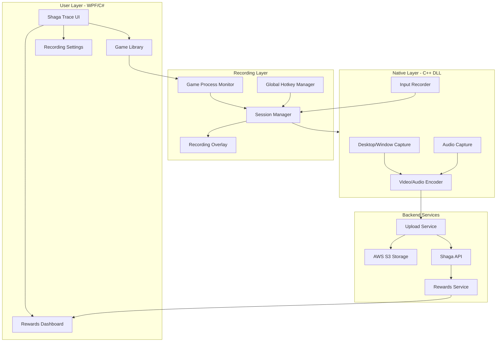
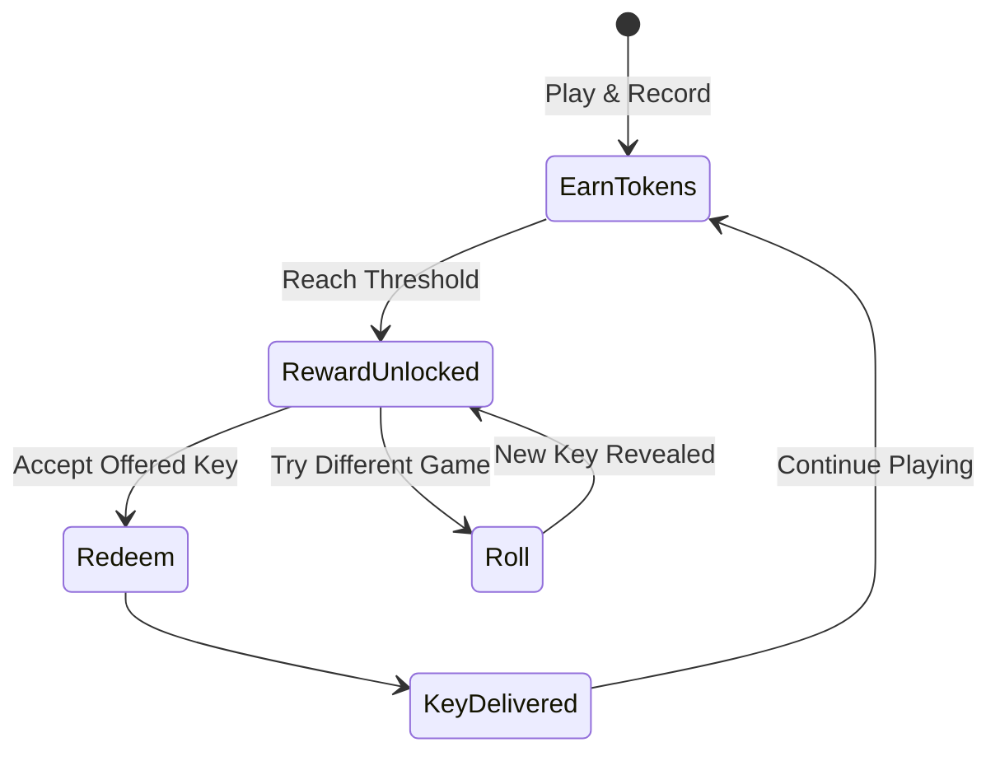

# Shaga Trace Business Plan

## Executive Summary

Shaga Trace is a desktop application that combines a feature-rich game library manager (based on Playnite) with gameplay recording capabilities to collect high-quality training data for AI models. Users are rewarded with game keys through an innovative "Redeem or Roll" gamification system, creating a self-sustaining ecosystem for data collection.

---

## 1. Product Vision

### Core Value Proposition

| Stakeholder | Value |
|-------------|-------|
| **Users** | Free game keys for playing games they already enjoy |
| **AI Companies** | High-quality labeled gameplay data with control inputs |
| **Game Publishers** | Analytics insights, user acquisition channel |

### Why Build on Playnite

- **Instant Credibility**: Established open-source launcher with loyal community
- **Game Database**: Comprehensive metadata from Steam, Epic, GOG, EA, Battle.net, etc.
- **Plugin Architecture**: Extensible for library integrations and metadata enrichment
- **User Familiarity**: Reduced onboarding friction for existing Playnite users

---

## 2. Technical Architecture

### Key Components (from existing codebase)

| Component | Source | Status |
|-----------|--------|--------|
| Game Library UI | [`source/Playnite.DesktopApp/`](source/Playnite.DesktopApp/) | Ready |
| Game Database | [`source/Playnite/Database/GameDatabase.cs`](source/Playnite/Database/GameDatabase.cs) | Ready |
| Desktop Capture | [`reference-code/include/app/video/desktop_capture.hpp`](reference-code/include/app/video/desktop_capture.hpp) | Needs Integration |
| Input Recording | [`reference-code/include/app/input/input_event_recorder.hpp`](reference-code/include/app/input/input_event_recorder.hpp) | Needs Integration |
| Video Encoding | [`reference-code/include/app/encode/`](reference-code/include/app/encode/) | Needs Integration |
| Upload System | [`reference-code/include/app/upload/recording_uploader.hpp`](reference-code/include/app/upload/recording_uploader.hpp) | Needs Integration |
| Shaga Integration | [`source/Playnite/Recording/`](source/Playnite/Recording/) (trace branch) | In Progress |

---

## 3. Data Product Strategy

### Data Assets Collected

1. **Video Frames** - 1080p/720p @ 30-60fps H.264 encoded
2. **Control Inputs** - Timestamped keyboard, mouse, gamepad events (JSONL)
3. **Game Metadata** - Title, genre, platform, session context from Playnite DB
4. **Audio** - Game audio (Opus encoded) for multimodal models

### Data Quality Requirements

- Minimum 10 minutes per valid session
- Active input detected (no idle/AFK farming)
- PvE gameplay only (per OWL Control model)
- Validated game titles from approved list

### Target Customers

| Customer Type | Use Case | Data Format |
|---------------|----------|-------------|
| World Model Training | Robotics, simulation | Video + Actions |
| Game AI | NPC behavior, playtesting | Inputs + Context |
| Accessibility | Eye tracking, assistive tech | Input patterns |
| Research | Academic studies | Anonymized datasets |

---

## 4. Rewards System: "Redeem or Roll"

### Gamification Mechanics

### Token Economy

| Action | Tokens Earned |
|--------|---------------|
| 1 hour validated gameplay | 100 tokens |
| High-quality session bonus | +25 tokens |
| Popular game multiplier | 1.5x |
| First upload of the day | +50 tokens |

### Reward Tiers

| Tier | Cost | Examples |
|------|------|----------|
| Bronze | 500 tokens | Indie games, older AAA |
| Silver | 1500 tokens | Mid-tier releases |
| Gold | 3000 tokens | Recent AAA titles |

### Roll Mechanics

- **Free Roll**: Once per reward tier unlock
- **Paid Roll**: 100 tokens for re-roll
- **Guarantee**: After 3 rolls, next roll guaranteed different category

---

## 5. User Acquisition Strategy

### Phase 1: Playnite Community (Months 1-3)

- Position as "Playnite with rewards"
- Target: 10,000 active users
- Channel: Playnite Discord, Reddit r/playnite, gaming forums

### Phase 2: Streamer Partnerships (Months 4-6)

- Partner with mid-tier streamers (10k-100k followers)
- Referral bonus system
- Target: 50,000 active users

### Phase 3: Gaming Communities (Months 7-12)

- Gaming Discord servers
- Steam community groups
- Target: 200,000 active users

---

## 6. Revenue Model

### Primary Revenue: Data Sales

| Data Package | Price Point | Volume |
|--------------|-------------|--------|
| Raw Footage (TB) | $500/TB | Bulk |
| Labeled Dataset | $2,000-10,000 | Per game/genre |
| Custom Collection | Negotiated | Enterprise |

### Secondary Revenue

- Premium features (priority uploads, extended storage)
- Partner game key commissions
- Analytics dashboard for game publishers

### Cost Structure

| Cost | Monthly Estimate |
|------|------------------|
| AWS S3 Storage | $0.023/GB |
| Game Keys (wholesale) | 40-60% retail |
| Infrastructure | $2,000-5,000 |
| Support | $1,000-3,000 |

---

## 7. Implementation Roadmap

### Phase 1: Foundation (Current - trace branch)

- Complete native DLL integration
- Stabilize recording pipeline
- Implement basic upload to S3

### Phase 2: Rewards MVP

- Backend rewards API
- Token tracking system
- Basic redeem flow (no roll yet)

### Phase 3: Gamification

- Full "Redeem or Roll" UI
- Leaderboards and achievements
- Social sharing

### Phase 4: Scale

- Multi-region upload optimization
- Data quality ML pipeline
- Enterprise sales tools

---

## 8. Competitive Analysis

| Feature | Shaga Trace | OWL Control | Traditional Capture |
|---------|-------------|-------------|---------------------|
| Game Library Manager | Yes | No | No |
| Familiar UI (Playnite) | Yes | No | N/A |
| Reward System | Gamified | Cash payout | None |
| Auto-game Detection | Yes | Manual | Manual |
| Metadata Enrichment | Full (Playnite DB) | Basic | None |

### Key Differentiators

1. **Game Launcher Integration**: Not just a recorder, it's your game hub
2. **Gamified Rewards**: More engaging than simple cash payouts
3. **Playnite Foundation**: Proven UI/UX, existing community trust

---

## 9. Risk Mitigation

| Risk | Mitigation |
|------|------------|
| Privacy concerns | Transparent data policy, only in-game capture |
| Game TOS violations | Work with publishers, focus on PvE |
| Data quality spam | ML validation, human review sampling |
| User churn | Engaging reward system, regular key refreshes |

---

## 10. Success Metrics

| KPI | 6 Month Target | 12 Month Target |
|-----|----------------|-----------------|
| Monthly Active Users | 25,000 | 100,000 |
| Recording Hours/Month | 50,000 | 250,000 |
| Data Revenue/Month | $20,000 | $100,000 |
| User Retention (30d) | 40% | 55% |

---

## Next Steps

1. **Complete trace branch** - Finish C++ DLL integration and recording pipeline
2. **Build rewards backend** - API, token system, key inventory management
3. **Legal review** - Privacy policy, terms of service, game publisher outreach
4. **Beta launch** - Soft launch with Playnite community