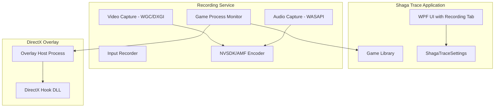

# Shaga Trace Implementation Plan

## Overview

This plan transforms Playnite into **Shaga Trace** - a game launcher with integrated gameplay recording (video, audio, input) similar to OWL Control. The implementation is phased: branding first, then core recording infrastructure, followed by the overlay and upload systems.

## Architecture



## Phase 1: Full Rebranding to Shaga Trace

### 1.1 Core Application Identity

- Rename solution and projects from `Playnite` to `ShagaTrace`
- Update [`source/Playnite/App.config`](source/Playnite/App.config) and assembly info
- Replace application icon and splash screen in [`source/Playnite/Resources/`](source/Playnite/Resources/)
- Update [`source/Playnite.DesktopApp/App.xaml`](source/Playnite.DesktopApp/App.xaml) and window titles

### 1.2 Branding Assets

- Replace logos in [`media/`](media/) with Shaga branding from brand kit
- Update tray icons (Default, Bright, Dark variants)
- Create new installer branding

### 1.3 Localization Updates

- Update [`source/Playnite/Localization/`](source/Playnite/Localization/) string resources
- Change "Playnite" references to "Shaga Trace"

## Phase 2: Recording Settings Infrastructure

### 2.1 Settings Model

Add to [`source/Playnite/Settings/PlayniteSettings.cs`](source/Playnite/Settings/PlayniteSettings.cs):

```csharp
// New settings class for Shaga Trace recording
public class ShagaTraceRecordingSettings : ObservableObject
{
    public bool RecordingEnabled { get; set; }
    public string RecordingHotkey { get; set; } = "F5";
    public string RecordingsDirectory { get; set; }
    public int VideoWidth { get; set; } = 1280;
    public int VideoHeight { get; set; } = 720;
    public int VideoFps { get; set; } = 60;
    public EncoderType PreferredEncoder { get; set; }
    public bool RecordAudio { get; set; } = true;
    public bool RecordInputs { get; set; } = true;
    public bool ShowOverlay { get; set; } = true;
}
```

### 2.2 New Settings Tab

- Add `ShagaTrace = 26` to `DesktopSettingsPage` enum in [`PlayniteSettings.cs`](source/Playnite/Settings/PlayniteSettings.cs)
- Create `source/Playnite.DesktopApp/Controls/SettingsSections/ShagaTrace.xaml` 
- Register in [`SettingsViewModel.cs`](source/Playnite.DesktopApp/ViewModels/SettingsViewModel.cs) sectionViews dictionary
- Add TreeViewItem to [`SettingsWindow.xaml`](source/Playnite.DesktopApp/Windows/SettingsWindow.xaml)

## Phase 3: Game Process Monitoring Service

### 3.1 Background Monitor Service

Create `source/Playnite/Services/GameProcessMonitor.cs`:

- Runs as background thread monitoring running processes
- Maintains whitelist of supported game executables (from reference-code's `game-process-dataset.json`)
- Fires events when supported games start/stop

### 3.2 Integration Points

- Hook into existing [`GamesEditor.cs`](source/Playnite/GamesEditor.cs) `Controllers_Started`/`Controllers_Stopped` events
- Add parallel process scanning for externally-launched games

## Phase 4: Recording Engine (C# Implementation)

### 4.1 Video Capture

Create `source/Playnite/Recording/VideoCapture/`:

- `IVideoCapture.cs` - interface for capture backends
- `WindowsGraphicsCapture.cs` - WGC-based capture (Windows 10+)
- `DxgiDuplication.cs` - DXGI Desktop Duplication fallback

### 4.2 Video Encoding

Create `source/Playnite/Recording/Encoding/`:

- `IVideoEncoder.cs` - encoder interface
- `NvsdkEncoder.cs` - NVIDIA NVENC via NVSDK (P/Invoke to nvEncodeAPI64.dll)
- `AmfEncoder.cs` - AMD AMF encoder (P/Invoke to amfrt64.dll)
- `SoftwareEncoder.cs` - FFmpeg-based fallback

Reference the existing encoder headers in [`reference-code/include/app/encode/`](reference-code/include/app/encode/) for API patterns.

### 4.3 Audio Capture

Create `source/Playnite/Recording/Audio/`:

- `WasapiCapture.cs` - WASAPI loopback capture for system audio
- `OpusEncoder.cs` - Opus encoding for audio stream

### 4.4 Input Recording

Create `source/Playnite/Recording/Input/`:

- `InputRecorder.cs` - Records keyboard, mouse, gamepad inputs
- Uses existing SDL2 bindings from [`source/Playnite/SDL2.cs`](source/Playnite/SDL2.cs)
- Outputs JSONL format matching reference-code's [`InputEventRecorder`](reference-code/include/app/input/input_event_recorder.hpp)

### 4.5 Recording Session Manager

Create `source/Playnite/Recording/RecordingSessionManager.cs`:

- Coordinates video, audio, and input capture
- Manages recording start/stop via hotkey
- Writes output files (H.264 video + Opus audio in container, JSONL inputs)

## Phase 5: DirectX Overlay System

### 5.1 Overlay Architecture

Create separate overlay project `source/ShagaTrace.Overlay/`:

- Lightweight process that injects into game processes
- Uses DirectX hook (similar to ReShade/RTSS pattern)
- Renders "Press F5 to record" indicator and recording status

### 5.2 Overlay Components

- `OverlayHost.exe` - Main overlay coordinator process
- `ShagaTraceHook.dll` - DirectX 11/12 hook DLL for injection
- IPC communication with main Shaga Trace app via named pipes

### 5.3 Overlay UI

- Minimal overlay showing: recording status, hotkey hint, recording duration
- Configurable position (corner selection in settings)
- Fade-in/out animations

## Phase 6: Upload and Storage System

### 6.1 Recording Management

- File watcher for completed recordings
- Validation (minimum duration, activity detection)
- Storage management (configurable location, cleanup)

### 6.2 Upload Service (Future)

- Queue-based upload system
- Integration point for Shaga backend API

## Key Files to Modify

| File | Changes |

|------|---------|

| [`source/Playnite/Settings/PlayniteSettings.cs`](source/Playnite/Settings/PlayniteSettings.cs) | Add ShagaTraceRecordingSettings, new settings page enum |

| [`source/Playnite/GamesEditor.cs`](source/Playnite/GamesEditor.cs) | Integrate recording triggers in Controllers_Started/Stopped |

| [`source/Playnite.DesktopApp/ViewModels/SettingsViewModel.cs`](source/Playnite.DesktopApp/ViewModels/SettingsViewModel.cs) | Register new settings section |

| [`source/Playnite.DesktopApp/Windows/SettingsWindow.xaml`](source/Playnite.DesktopApp/Windows/SettingsWindow.xaml) | Add Shaga Trace settings tree item |

| [`source/Playnite.DesktopApp/App.xaml`](source/Playnite.DesktopApp/App.xaml) | Update application branding |

## Dependencies to Add

- SharpDX or Vortice.Windows for DirectX interop
- NAudio for WASAPI audio capture
- Concentus for Opus encoding
- Native DLLs: nvEncodeAPI64.dll, amfrt64.dll (from GPU driver installations)

## Risks and Mitigations

1. **NVSDK/AMF C# bindings** - Complex P/Invoke; consider using existing wrappers like NvPipe or building minimal bindings from reference-code headers
2. **DirectX overlay injection** - Anti-cheat may block; document supported games list
3. **Performance impact** - Hardware encoding essential; profile and optimize capture path